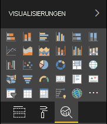

# <a name="the-analytics-pane-in-power-bi-visuals"></a><span data-ttu-id="60af6-103">Der Bereich „Analyse“ in Power BI-Visuals</span><span class="sxs-lookup"><span data-stu-id="60af6-103">The Analytics pane in Power BI visuals</span></span>

<span data-ttu-id="60af6-104">Der Bereich **Analyse** wurde im November 2018 für [native Visuals](https://docs.microsoft.com/power-bi/desktop-analytics-pane) eingeführt.</span><span class="sxs-lookup"><span data-stu-id="60af6-104">The **Analytics** pane was introduced for [native visuals](https://docs.microsoft.com/power-bi/desktop-analytics-pane) in November 2018.</span></span>
<span data-ttu-id="60af6-105">In diesem Artikel wird erläutert, wie Power BI-Visuals mithilfe von Version 2.5.0 der API ihre Eigenschaften im Bereich **Analyse** präsentieren und verwalten können.</span><span class="sxs-lookup"><span data-stu-id="60af6-105">This article discusses how Power BI visuals with API v2.5.0 can present and manage their properties in the **Analytics** pane.</span></span>



## <a name="manage-the-analytics-pane"></a><span data-ttu-id="60af6-107">Verwalten des Bereichs „Analyse“</span><span class="sxs-lookup"><span data-stu-id="60af6-107">Manage the Analytics pane</span></span>

<span data-ttu-id="60af6-108">Genauso wie Sie Eigenschaften im [Bereich **Format**](https://docs.microsoft.com/power-bi/developer/visuals/custom-visual-develop-tutorial-format-options) verwalten können, können Sie auch den Bereich **Analyse** verwalten, indem Sie ein Objekt in der Datei *capabilities.json* des Visuals definieren.</span><span class="sxs-lookup"><span data-stu-id="60af6-108">Just as you'd manage properties in the [**Format** pane](https://docs.microsoft.com/power-bi/developer/visuals/custom-visual-develop-tutorial-format-options), you manage the **Analytics** pane by defining an object in the visual's *capabilities.json* file.</span></span>

<span data-ttu-id="60af6-109">Es gelten die folgenden Unterschiede für den Bereich **Analyse**:</span><span class="sxs-lookup"><span data-stu-id="60af6-109">For the **Analytics** pane, the differences are as follows:</span></span>

* <span data-ttu-id="60af6-110">Fügen Sie unter der Objektdefinition ein **objectCategory**-Feld mit dem Wert 2 hinzu.</span><span class="sxs-lookup"><span data-stu-id="60af6-110">Under the object's definition, you add an **objectCategory** field with a value of 2.</span></span>

    > [!NOTE]
    > <span data-ttu-id="60af6-111">Das optionale Feld `objectCategory` wurde im Rahmen der Version 2.5.0 der API eingeführt.</span><span class="sxs-lookup"><span data-stu-id="60af6-111">The optional `objectCategory` field was introduced in API 2.5.0.</span></span> <span data-ttu-id="60af6-112">Damit wird der Aspekt des Visuals definiert, der durch das Objekt gesteuert wird (1 = Formatierung, 2 = Analytics).</span><span class="sxs-lookup"><span data-stu-id="60af6-112">It defines the aspect of the visual that the object controls (1 = Formatting, 2 = Analytics).</span></span> <span data-ttu-id="60af6-113">`Formatting` wird für Elemente wie das Erscheinungsbild, Farben, Achsen und Bezeichnungen verwendet.</span><span class="sxs-lookup"><span data-stu-id="60af6-113">`Formatting` is used for such elements as look and feel, colors, axes, and labels.</span></span> <span data-ttu-id="60af6-114">`Analytics` wird für Elemente wie Vorhersagen, Trendlinien, Bezugslinien und Formen verwendet.</span><span class="sxs-lookup"><span data-stu-id="60af6-114">`Analytics` is used for such elements as forecasts, trendlines, reference lines, and shapes.</span></span>
    >
    > <span data-ttu-id="60af6-115">Wenn der Wert nicht angegeben wird, hat `objectCategory` standardmäßig den Wert „Formatierung“.</span><span class="sxs-lookup"><span data-stu-id="60af6-115">If the value isn't specified, `objectCategory` defaults to "Formatting."</span></span>

* <span data-ttu-id="60af6-116">Das Objekt muss die beiden folgenden Eigenschaften aufweisen:</span><span class="sxs-lookup"><span data-stu-id="60af6-116">The object must have the following two properties:</span></span>
    * <span data-ttu-id="60af6-117">`show` vom Typ `bool` mit dem Standardwert `false`.</span><span class="sxs-lookup"><span data-stu-id="60af6-117">`show` of type `bool`, with a default value of `false`.</span></span>
    * <span data-ttu-id="60af6-118">`displayName` vom Typ `text`.</span><span class="sxs-lookup"><span data-stu-id="60af6-118">`displayName` of type `text`.</span></span> <span data-ttu-id="60af6-119">Der von Ihnen ausgewählte Standardwert wird zum ursprünglichen Anzeigenamen der Instanz.</span><span class="sxs-lookup"><span data-stu-id="60af6-119">The default value that you choose becomes the instance's initial display name.</span></span>

```json
{
  "objects": {
    "YourAnalyticsPropertiesCard": {
      "displayName": "Your analytics properties card's name",
      "objectCategory": 2,
      "properties": {
        "show": {
          "type": {
            "bool": true
          }
        },
        "displayName": {
          "type": {
            "text": true
          }
        },
      ... //any other properties for your Analytics card
      }
    }
  ...
  }
}
```

<span data-ttu-id="60af6-120">Sie können andere Eigenschaften auf die gleiche Weise wie bei **Formatobjekten** definieren.</span><span class="sxs-lookup"><span data-stu-id="60af6-120">You can define other properties in the same way that you do for **Format** objects.</span></span> <span data-ttu-id="60af6-121">Außerdem können Sie Objekte genauso wie im Bereich **Format** auflisten.</span><span class="sxs-lookup"><span data-stu-id="60af6-121">And you can enumerate objects just as you do in the **Format** pane.</span></span>

## <a name="known-limitations-and-issues-of-the-analytics-pane"></a><span data-ttu-id="60af6-122">Bekannte Einschränkungen und Probleme des Bereichs „Analyse“</span><span class="sxs-lookup"><span data-stu-id="60af6-122">Known limitations and issues of the Analytics pane</span></span>

* <span data-ttu-id="60af6-123">Die Verwendung von mehreren Instanzen werden im Bereich **Analyse** noch nicht unterstützt.</span><span class="sxs-lookup"><span data-stu-id="60af6-123">The **Analytics** pane has no multi-instance support yet.</span></span> <span data-ttu-id="60af6-124">Objekte können nur den [Selektor](https://microsoft.github.io/PowerBI-visuals/docs/concepts/objects-and-properties/#selector) „static“ (d. h. Selektor: NULL) haben, und Power BI-Visuals können nicht mehrere benutzerdefinierte Instanzen einer Karte aufweisen.</span><span class="sxs-lookup"><span data-stu-id="60af6-124">Objects can't have a [selector](https://microsoft.github.io/PowerBI-visuals/docs/concepts/objects-and-properties/#selector) other than static (that is, "selector": null), and Power BI visuals can't have user-defined multiple instances of a card.</span></span>
* <span data-ttu-id="60af6-125">Eigenschaften des Typs `integer` werden nicht korrekt angezeigt.</span><span class="sxs-lookup"><span data-stu-id="60af6-125">Properties of type `integer` aren't displayed correctly.</span></span> <span data-ttu-id="60af6-126">Verwenden Sie als Problemumgehung den Typ `numeric`.</span><span class="sxs-lookup"><span data-stu-id="60af6-126">As a workaround, use type `numeric` instead.</span></span>

> [!NOTE]
> * <span data-ttu-id="60af6-127">Verwenden Sie den Bereich **Analyse** nur für Objekte, durch die neue Informationen hinzugefügt bzw. die dargestellten Informationen in einem neuen Blickwickel betrachtet werden (z. B. dynamische Bezugslinien, die wichtige Trends darstellen).</span><span class="sxs-lookup"><span data-stu-id="60af6-127">Use the **Analytics** pane only for objects that add new information or shed new light on the presented information (for example, dynamic reference lines that illustrate important trends).</span></span>
> * <span data-ttu-id="60af6-128">Alle Optionen, die das Erscheinungsbild des Visuals bestimmen (d. h. Formatierungen), sollten auf den Bereich **Formatierung** beschränkt werden.</span><span class="sxs-lookup"><span data-stu-id="60af6-128">Any options that control the look and feel of the visual (that is, formatting) should be limited to the **Formatting** pane.</span></span>
