# <a name="tutorial-developing-a-power-bi-visual"></a><span data-ttu-id="26e78-103">Tutorial: Entwickeln eines Power BI-Visuals</span><span class="sxs-lookup"><span data-stu-id="26e78-103">Tutorial: Developing a Power BI visual</span></span>

<span data-ttu-id="26e78-104">Wir machen es für Entwickler einfach, ihre Power BI-Visuals in Power BI hinzuzufügen, um diese in Dashboards und Berichten zu verwenden.</span><span class="sxs-lookup"><span data-stu-id="26e78-104">We’re enabling developers to easily add Power BI visuals into Power BI for use in dashboard and reports.</span></span> <span data-ttu-id="26e78-105">Wir haben den Code für alle unsere Visualisierungen auf GitHub veröffentlicht, um Ihnen den Einstieg zu erleichtern.</span><span class="sxs-lookup"><span data-stu-id="26e78-105">To help you get started, we’ve published the code for all of our visualizations to GitHub.</span></span>

<span data-ttu-id="26e78-106">Zusammen mit dem Visualisierungsframework haben wir unsere Testsammlung und Tools bereitgestellt, damit die Community qualitativ hochwertige Power BI-Visuals für Power BI erstellen kann.</span><span class="sxs-lookup"><span data-stu-id="26e78-106">Along with the visualization framework, we’ve provided our test suite and tools to help the community build high-quality Power BI visuals for Power BI.</span></span>

<span data-ttu-id="26e78-107">In diesem Tutorial erfahren Sie, wie Sie ein benutzerdefiniertes Visual für Power BI mit der Bezeichnung „Circle Card“ entwickeln, um einen formatierten Kennzahlenwert in einem Kreis anzuzeigen.</span><span class="sxs-lookup"><span data-stu-id="26e78-107">This tutorial shows you how to develop a Power BI custom visual named Circle Card to display a formatted measure value inside a circle.</span></span> <span data-ttu-id="26e78-108">Das Visual „Circle Card“ unterstützt die Anpassung der Füllfarbe und der Stärke der Kontur.</span><span class="sxs-lookup"><span data-stu-id="26e78-108">The Circle Card visual supports customization of fill color and thickness of its outline.</span></span>

<span data-ttu-id="26e78-109">Im Power BI Desktop-Bericht werden die Karten in Circle Cards umgewandelt.</span><span class="sxs-lookup"><span data-stu-id="26e78-109">In the Power BI Desktop report, the cards are modified to become Circle Cards.</span></span>

  

<span data-ttu-id="26e78-111">In diesem Tutorial erhalten Sie Informationen zu den folgenden Vorgängen:</span><span class="sxs-lookup"><span data-stu-id="26e78-111">In this tutorial, you learn how to:</span></span>
> [!div class="checklist"]
> * <span data-ttu-id="26e78-112">Erstellen eines benutzerdefinierten Visuals für Power BI.</span><span class="sxs-lookup"><span data-stu-id="26e78-112">Create a Power BI custom visual.</span></span>
> * <span data-ttu-id="26e78-113">Entwickeln eines benutzerdefinierten Visuals mit visuellen D3-Elementen.</span><span class="sxs-lookup"><span data-stu-id="26e78-113">Develop the custom visual with D3 visual elements.</span></span>
> * <span data-ttu-id="26e78-114">Konfigurieren einer Datenbindung mit den visuellen Elementen.</span><span class="sxs-lookup"><span data-stu-id="26e78-114">Configure data binding with the visual elements.</span></span>
> * <span data-ttu-id="26e78-115">Formatieren von Datenwerten.</span><span class="sxs-lookup"><span data-stu-id="26e78-115">Format data values.</span></span>

## <a name="prerequisites"></a><span data-ttu-id="26e78-116">Voraussetzungen</span><span class="sxs-lookup"><span data-stu-id="26e78-116">Prerequisites</span></span>

* <span data-ttu-id="26e78-117">Wenn Sie noch nicht bei **Power BI Pro** registriert sind, [registrieren Sie sich für eine kostenlose Testversion](https://powerbi.microsoft.com/pricing/), bevor Sie beginnen.</span><span class="sxs-lookup"><span data-stu-id="26e78-117">If you're not signed up for **Power BI Pro**, [sign up for a free trial](https://powerbi.microsoft.com/pricing/) before you begin.</span></span>
* <span data-ttu-id="26e78-118">Sie müssen [Visual Studio Code](https://www.visualstudio.com/) installieren.</span><span class="sxs-lookup"><span data-stu-id="26e78-118">You need [Visual Studio Code](https://www.visualstudio.com/) installed.</span></span>
* <span data-ttu-id="26e78-119">Die benötigen die [Windows PowerShell](https://docs.microsoft.com/powershell/scripting/setup/installing-windows-powershell?view=powershell-6)-Version 4 oder höher für Windows-Benutzer ODER das [Terminal](https://macpaw.com/how-to/use-terminal-on-mac) für OSX-Benutzer.</span><span class="sxs-lookup"><span data-stu-id="26e78-119">You need [Windows PowerShell](https://docs.microsoft.com/powershell/scripting/setup/installing-windows-powershell?view=powershell-6) version 4 or later for windows users OR the [Terminal](https://macpaw.com/how-to/use-terminal-on-mac) for OSX users.</span></span>

## <a name="setting-up-the-developer-environment"></a><span data-ttu-id="26e78-120">Einrichten der Entwicklerumgebung</span><span class="sxs-lookup"><span data-stu-id="26e78-120">Setting up the developer environment</span></span>

<span data-ttu-id="26e78-121">Zusätzlich zu den Voraussetzungen gibt es einige weitere Tools, die Sie installieren müssen.</span><span class="sxs-lookup"><span data-stu-id="26e78-121">In addition to the prerequisites, there are a few more tools you need to install.</span></span>

### <a name="installing-nodejs"></a><span data-ttu-id="26e78-122">Installieren von node.js</span><span class="sxs-lookup"><span data-stu-id="26e78-122">Installing node.js</span></span>

1. <span data-ttu-id="26e78-123">Zum Installieren von Node.js navigieren Sie in einem Webbrowser zu [Node.js](https://nodejs.org).</span><span class="sxs-lookup"><span data-stu-id="26e78-123">To install Node.js, in a web browser, navigate to [Node.js](https://nodejs.org).</span></span>

2. <span data-ttu-id="26e78-124">Laden Sie das aktuellste MSI-Installationsprogramm herunter.</span><span class="sxs-lookup"><span data-stu-id="26e78-124">Download the latest feature MSI installer.</span></span>

3. <span data-ttu-id="26e78-125">Führen Sie das Installationsprogramm aus, und befolgen Sie dann die Installationsschritte.</span><span class="sxs-lookup"><span data-stu-id="26e78-125">Run the installer, and then follow the installation steps.</span></span> <span data-ttu-id="26e78-126">Stimmen Sie den Bedingungen des Lizenzvertrags zu und übernehmen Sie alle Standardwerte.</span><span class="sxs-lookup"><span data-stu-id="26e78-126">Accept the terms of the license agreement and all defaults.</span></span>

   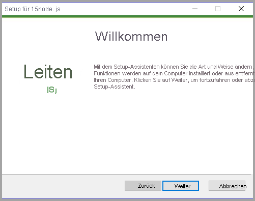

4. <span data-ttu-id="26e78-128">Starten Sie den Computer neu.</span><span class="sxs-lookup"><span data-stu-id="26e78-128">Restart the computer.</span></span>

### <a name="installing-packages"></a><span data-ttu-id="26e78-129">Installieren von Paketen</span><span class="sxs-lookup"><span data-stu-id="26e78-129">Installing packages</span></span>

<span data-ttu-id="26e78-130">Jetzt müssen Sie das **pbiviz**-Paket installieren.</span><span class="sxs-lookup"><span data-stu-id="26e78-130">Now you need to install the **pbiviz** package.</span></span>

1. <span data-ttu-id="26e78-131">Öffnen Sie nach dem Neustart des Computers Windows PowerShell.</span><span class="sxs-lookup"><span data-stu-id="26e78-131">Open Windows PowerShell after the computer has been restarted.</span></span>

2. <span data-ttu-id="26e78-132">Geben Sie zum Installieren von pbiviz den folgenden Befehl ein.</span><span class="sxs-lookup"><span data-stu-id="26e78-132">To install pbiviz, enter the following command.</span></span>

    ```powershell
    npm i -g powerbi-visuals-tools
    ```

### <a name="creating-and-installing-a-certificate"></a><span data-ttu-id="26e78-133">Erstellen und Installieren eines Zertifikats</span><span class="sxs-lookup"><span data-stu-id="26e78-133">Creating and installing a certificate</span></span>

#### <a name="windows"></a><span data-ttu-id="26e78-134">Windows</span><span class="sxs-lookup"><span data-stu-id="26e78-134">Windows</span></span>

1. <span data-ttu-id="26e78-135">Geben Sie zum Erstellen und Installieren eines Zertifikats den folgenden Befehl ein.</span><span class="sxs-lookup"><span data-stu-id="26e78-135">To create and install a certificate, enter the following command.</span></span>

    ```powershell
    pbiviz --install-cert
    ```

    <span data-ttu-id="26e78-136">Als Ergebnis wird eine *Passphrase* zurückgegeben.</span><span class="sxs-lookup"><span data-stu-id="26e78-136">It returns a result that produces a *passphrase*.</span></span> <span data-ttu-id="26e78-137">In diesem Fall lautet die *Passphrase* **_15105661266553327_** .</span><span class="sxs-lookup"><span data-stu-id="26e78-137">In this case, the *passphrase* is **_15105661266553327_**.</span></span> <span data-ttu-id="26e78-138">Der Befehl startet auch den Zertifikatimport-Assistenten.</span><span class="sxs-lookup"><span data-stu-id="26e78-138">It also starts the Certificate Import Wizard.</span></span>

    

2. <span data-ttu-id="26e78-140">Überprüfen Sie im Assistenten für den Zertifikatsimport, ob der Speicherort auf „Aktueller Benutzer“ eingestellt ist.</span><span class="sxs-lookup"><span data-stu-id="26e78-140">In the Certificate Import Wizard, verify that the store location is set to Current User.</span></span> <span data-ttu-id="26e78-141">Wählen Sie dann *Weiter*aus.</span><span class="sxs-lookup"><span data-stu-id="26e78-141">Then select *Next*.</span></span>

      

3. <span data-ttu-id="26e78-143">Wählen Sie im Schritt **Zu importierende Datei** *Weiter* aus.</span><span class="sxs-lookup"><span data-stu-id="26e78-143">At the **File to Import** step, select *Next*.</span></span>

4. <span data-ttu-id="26e78-144">Fügen Sie im Schritt **Privater Schlüsselschutz** im Feld „Passwort“ die Passphrase ein, die Sie beim Erstellen des Zertifikats erhalten haben.  In diesem Fall wieder **_15105661266553327_** .</span><span class="sxs-lookup"><span data-stu-id="26e78-144">At the **Private Key Protection** step, in the Password box, paste the passphrase you received from creating the cert.  Again, in this case it is **_15105661266553327_**.</span></span>

      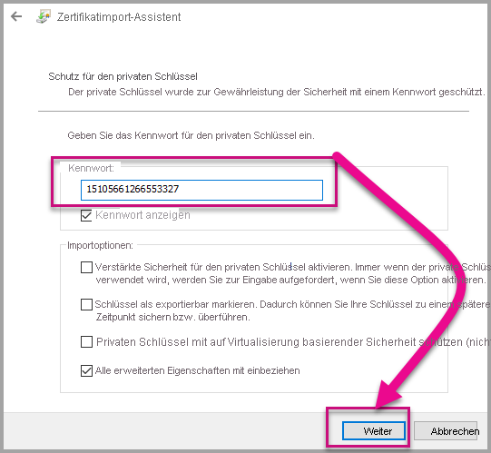

5. <span data-ttu-id="26e78-146">Wählen Sie im Schritt **Zertifikatspeicher** die Option **AAlle Zertifikate in folgendem Speicher speichern**.</span><span class="sxs-lookup"><span data-stu-id="26e78-146">At the **Certificate Store** step, select the **Place all certificates in the Following store** option.</span></span> <span data-ttu-id="26e78-147">Wählen Sie anschließend *Durchsuchen*.</span><span class="sxs-lookup"><span data-stu-id="26e78-147">Then select *Browse*.</span></span>

      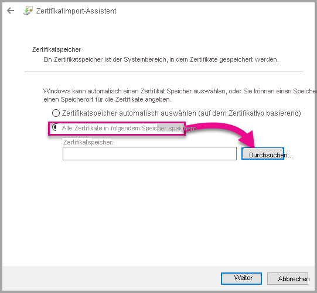

6. <span data-ttu-id="26e78-149">Wählen Sie im Fenster **Zertifikatspeicher auswählen** **Vertrauenswürdige Stammzertifizierungsstellen** und dann *OK* aus.</span><span class="sxs-lookup"><span data-stu-id="26e78-149">In the **Select Certificate Store** window, select **Trusted Root Certification Authorities** and then select *OK*.</span></span> <span data-ttu-id="26e78-150">Wählen Sie dann im Bildschirm *Zertifikatspeicher* **Weiter**.</span><span class="sxs-lookup"><span data-stu-id="26e78-150">Then select *Next* on the **Certificate Store** screen.</span></span>

      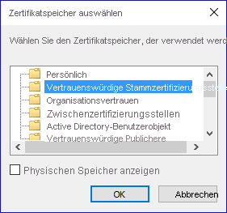

7. <span data-ttu-id="26e78-152">Um den Import abzuschließen, wählen Sie **Fertig stellen** aus.</span><span class="sxs-lookup"><span data-stu-id="26e78-152">To complete the import, select **Finish**.</span></span>

8. <span data-ttu-id="26e78-153">Wenn eine Sicherheitswarnung angezeigt wird, wählen Sie **Ja** aus.</span><span class="sxs-lookup"><span data-stu-id="26e78-153">If you receive a security warning, select **Yes**.</span></span>

    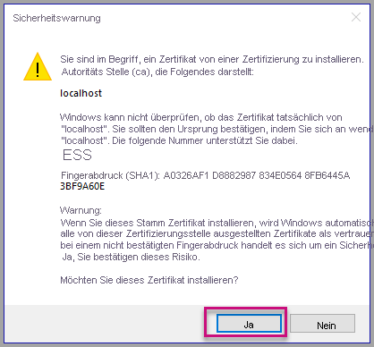

9. <span data-ttu-id="26e78-155">Wenn Sie benachrichtigt werden, dass der Import erfolgreich war, wählen Sie **OK** aus.</span><span class="sxs-lookup"><span data-stu-id="26e78-155">When notified that the import was successful, select **OK**.</span></span>

    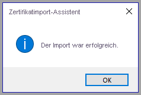

> [!Important]
> <span data-ttu-id="26e78-157">Schließen Sie die Windows PowerShell-Sitzung nicht.</span><span class="sxs-lookup"><span data-stu-id="26e78-157">Do not close the Windows PowerShell session.</span></span>

#### <a name="osx"></a><span data-ttu-id="26e78-158">OS X</span><span class="sxs-lookup"><span data-stu-id="26e78-158">OSX</span></span>

1. <span data-ttu-id="26e78-159">Wenn das Schloss in der oberen linken Ecke verriegelt angezeigt wird, wählen sie es zum Entsperren aus.</span><span class="sxs-lookup"><span data-stu-id="26e78-159">If the lock in the upper left is locked, select it to unlock.</span></span> <span data-ttu-id="26e78-160">Suchen Sie nach *localhost*, und doppelklicken Sie auf das Zertifikat.</span><span class="sxs-lookup"><span data-stu-id="26e78-160">Search for *localhost* and double-click on the certificate.</span></span>

    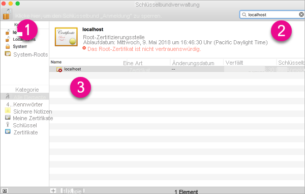

2. <span data-ttu-id="26e78-162">Wählen Sie **Immer vertrauen** aus, und schließen Sie das Fenster.</span><span class="sxs-lookup"><span data-stu-id="26e78-162">Select **Always Trust** and close the window.</span></span>

    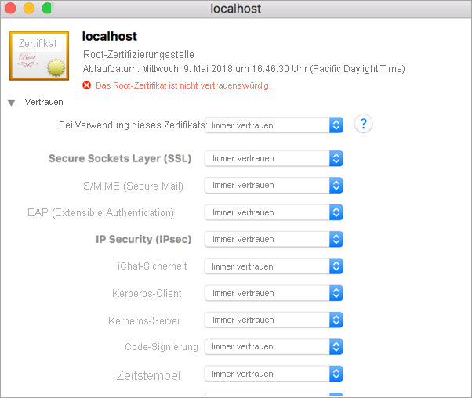

3. <span data-ttu-id="26e78-164">Geben Sie Ihren Benutzernamen und das Kennwort ein.</span><span class="sxs-lookup"><span data-stu-id="26e78-164">Enter your username and password.</span></span> <span data-ttu-id="26e78-165">Wählen Sie **Einstellungen aktualisieren** aus.</span><span class="sxs-lookup"><span data-stu-id="26e78-165">Select **Update Settings**.</span></span>

    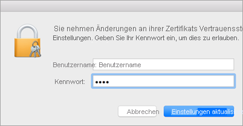

4. <span data-ttu-id="26e78-167">Schließen Sie alle geöffneten Browser.</span><span class="sxs-lookup"><span data-stu-id="26e78-167">Close any browsers that you have open.</span></span>

> [!NOTE]
> <span data-ttu-id="26e78-168">Wenn das Zertifikat nicht erkannt wird, müssen Sie möglicherweise den Computer neu starten.</span><span class="sxs-lookup"><span data-stu-id="26e78-168">If the certificate is not recognized, you may need to restart your computer.</span></span>

## <a name="creating-a-custom-visual"></a><span data-ttu-id="26e78-169">Erstellen eines benutzerdefinierten Visuals</span><span class="sxs-lookup"><span data-stu-id="26e78-169">Creating a custom visual</span></span>

<span data-ttu-id="26e78-170">Nachdem Sie Ihre Umgebung eingerichtet haben, können wir nun Ihr benutzerdefiniertes Visual erstellen.</span><span class="sxs-lookup"><span data-stu-id="26e78-170">Now that you have set up your environment, it is time to create your custom visual.</span></span>

<span data-ttu-id="26e78-171">Sie können den vollständigen Quellcode für dieses Tutorial [herunterladen](https://github.com/Microsoft/PowerBI-visuals-circlecard).</span><span class="sxs-lookup"><span data-stu-id="26e78-171">You can [download](https://github.com/Microsoft/PowerBI-visuals-circlecard) the full source code for this tutorial.</span></span>

1. <span data-ttu-id="26e78-172">Überprüfen Sie, ob das die Power BI-Tools-Paket für Visuals installiert wurde.</span><span class="sxs-lookup"><span data-stu-id="26e78-172">Verify that the Power BI Visual Tools package has been installed.</span></span>

    ```powershell
    pbiviz
    ```
    <span data-ttu-id="26e78-173">Die Hilfeausgabe sollte angezeigt werden.</span><span class="sxs-lookup"><span data-stu-id="26e78-173">You should see the help output.</span></span>

    <pre><code>
        +syyso+/
    oms/+osyhdhyso/
    ym/       /+oshddhys+/
    ym/              /+oyhddhyo+/
    ym/                     /osyhdho
    ym/                           sm+
    ym/               yddy        om+
    ym/         shho /mmmm/       om+
        /    oys/ +mmmm /mmmm/       om+
    oso  ommmh +mmmm /mmmm/       om+
    ymmmy smmmh +mmmm /mmmm/       om+
    ymmmy smmmh +mmmm /mmmm/       om+
    ymmmy smmmh +mmmm /mmmm/       om+
    +dmd+ smmmh +mmmm /mmmm/       om+
            /hmdo +mmmm /mmmm/ /so+//ym/
                /dmmh /mmmm/ /osyhhy/
                    //   dmmd
                        ++

        PowerBI Custom Visual Tool

    Usage: pbiviz [options] [command]

    Commands:

    new [name]        Create a new visual
    info              Display info about the current visual
    start             Start the current visual
    package           Package the current visual into a pbiviz file
    update [version]  Updates the api definitions and schemas in the current visual. Changes the version if specified
    help [cmd]        display help for [cmd]

    Options:

    -h, --help      output usage information
    -V, --version   output the version number
    --install-cert  Install localhost certificate
    </code></pre>

    <a name="ssl-setup"></a>

2. <span data-ttu-id="26e78-174">Überprüfen Sie die Ausgabe, einschließlich der Liste der unterstützten Befehle.</span><span class="sxs-lookup"><span data-stu-id="26e78-174">Review the output, including the list of supported commands.</span></span>

    

3. <span data-ttu-id="26e78-176">Geben Sie zum Erstellen eines benutzerdefiniertes Visualprojekts den folgenden Befehl ein.</span><span class="sxs-lookup"><span data-stu-id="26e78-176">To create a custom visual project, enter the following command.</span></span> <span data-ttu-id="26e78-177">Der Name des Projekts ist **CircleCard**.</span><span class="sxs-lookup"><span data-stu-id="26e78-177">**CircleCard** is the name of the project.</span></span>

    ```PowerShell
    pbiviz new CircleCard
    ```
    

    > [!Note]
    > <span data-ttu-id="26e78-179">Sie erstellen das neue Projekt am aktuellen Speicherort der Eingabeaufforderung.</span><span class="sxs-lookup"><span data-stu-id="26e78-179">You create the new project at the current location of the prompt.</span></span>

4. <span data-ttu-id="26e78-180">Navigieren Sie zum Projektordner.</span><span class="sxs-lookup"><span data-stu-id="26e78-180">Navigate to the project folder.</span></span>

    ```powershell
    cd CircleCard
    ```
5. <span data-ttu-id="26e78-181">Starten Sie das benutzerdefinierte Visual.</span><span class="sxs-lookup"><span data-stu-id="26e78-181">Start the custom visual.</span></span> <span data-ttu-id="26e78-182">Ihr CircleCard-Visual wird nun ausgeführt und wird auf Ihrem Computer gehostet.</span><span class="sxs-lookup"><span data-stu-id="26e78-182">Your CircleCard visual is now running while being hosted on your computer.</span></span>

    ```powershell
    pbiviz start
    ```

    

> [!Important]
> <span data-ttu-id="26e78-184">Schließen Sie die Windows PowerShell-Sitzung nicht.</span><span class="sxs-lookup"><span data-stu-id="26e78-184">Do not close the Windows PowerShell session.</span></span>

### <a name="testing-the-custom-visual"></a><span data-ttu-id="26e78-185">Testen des benutzerdefinierten Visuals</span><span class="sxs-lookup"><span data-stu-id="26e78-185">Testing the custom visual</span></span>

<span data-ttu-id="26e78-186">In diesem Abschnitt werden wir das benutzerdefinierte CircleCard-Visual testen, indem wir einen Power BI Desktop-Bericht hochladen und dann den Bericht bearbeiten, um das benutzerdefinierte Visual anzuzeigen.</span><span class="sxs-lookup"><span data-stu-id="26e78-186">In this section, we are going to test the CircleCard custom visual by uploading a Power BI Desktop report and then editing the report to display the custom visual.</span></span>

1. <span data-ttu-id="26e78-187">Melden Sie sich auf [Powerbi.com](https://powerbi.microsoft.com/) an > wechseln Sie zum **Zahnradsymbol** >, und wählen Sie dann **Einstellungen**.</span><span class="sxs-lookup"><span data-stu-id="26e78-187">Sign in to [PowerBI.com](https://powerbi.microsoft.com/) > go to the **Gear icon** > then select **Settings**.</span></span>

      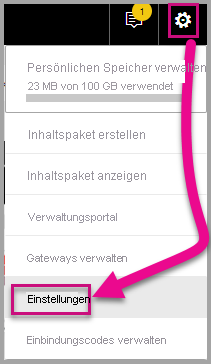

2. <span data-ttu-id="26e78-189">Wählen Sie **Entwickler** und aktivieren Sie das Kontrollkästchen **Visuelles Entwicklerelement zum Testen aktivieren** aus.</span><span class="sxs-lookup"><span data-stu-id="26e78-189">Select **Developer** then check the **Enable Developer Visual for testing** checkbox.</span></span>

    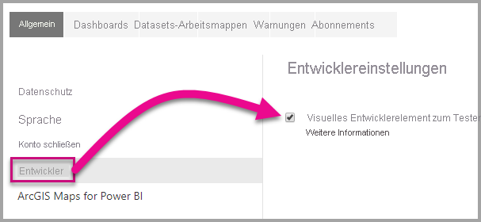

3. <span data-ttu-id="26e78-191">Laden Sie einen Power BI Desktop-Bericht hoch.</span><span class="sxs-lookup"><span data-stu-id="26e78-191">Upload a Power BI Desktop report.</span></span>  

    <span data-ttu-id="26e78-192">Daten abrufen > Dateien > Lokale Datei.</span><span class="sxs-lookup"><span data-stu-id="26e78-192">Get Data > Files > Local File.</span></span>

    <span data-ttu-id="26e78-193">Sie können einen Power BI Desktop-Beispielbericht [herunterladen](https://microsoft.github.io/PowerBI-visuals/docs/step-by-step-lab/images/US_Sales_Analysis.pbix), wenn Sie noch keinen erstellt haben.</span><span class="sxs-lookup"><span data-stu-id="26e78-193">You can [download](https://microsoft.github.io/PowerBI-visuals/docs/step-by-step-lab/images/US_Sales_Analysis.pbix) a sample Power BI Desktop report if you do not have one created already.</span></span>

    <span data-ttu-id="26e78-194"> </span><span class="sxs-lookup"><span data-stu-id="26e78-194"> </span></span>

    <span data-ttu-id="26e78-195">Um den Bericht anzuzeigen, wählen Sie **US_Sales_Analysis** im Abschnitt **Bericht** im linken Navigationsbereich.</span><span class="sxs-lookup"><span data-stu-id="26e78-195">Now to view the report, select **US_Sales_Analysis** from the **Report** section in the navigation pane on the left.</span></span>

    

4. <span data-ttu-id="26e78-197">Jetzt müssen Sie den Bericht im Power BI-Dienst bearbeiten.</span><span class="sxs-lookup"><span data-stu-id="26e78-197">Now you need to edit the report while in the Power BI service.</span></span>

    <span data-ttu-id="26e78-198">Rufen Sie **Bericht bearbeiten** auf.</span><span class="sxs-lookup"><span data-stu-id="26e78-198">Go to **Edit report**.</span></span>

    

5. <span data-ttu-id="26e78-200">Wählen Sie **Visuelles Entwicklerelement** im Bereich **Visualisierung** aus.</span><span class="sxs-lookup"><span data-stu-id="26e78-200">Select the **Developer Visual** from the **Visualizations** pane.</span></span>

    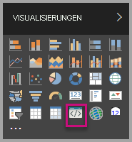

    > [!Note]
    > <span data-ttu-id="26e78-202">Diese Visualisierung stellt das benutzerdefinierte Visual dar, das Sie auf Ihrem Computer begonnen haben.</span><span class="sxs-lookup"><span data-stu-id="26e78-202">This visualization represents the custom visual that you started on your computer.</span></span> <span data-ttu-id="26e78-203">Es ist nur verfügbar, wenn die Entwicklereinstellungen aktiviert wurden.</span><span class="sxs-lookup"><span data-stu-id="26e78-203">It is only available when the developer settings have been enabled.</span></span>

6. <span data-ttu-id="26e78-204">Beachten Sie, dass eine Visualisierung in der Berichtscanvas hinzugefügt wurde.</span><span class="sxs-lookup"><span data-stu-id="26e78-204">Notice that a visualization was added to the report canvas.</span></span>

    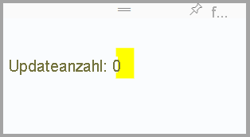

    > [!Note]
    > <span data-ttu-id="26e78-206">Dies ist ein sehr einfaches Visual, das anzeigt, wie oft seine Updatemethode aufgerufen wurde.</span><span class="sxs-lookup"><span data-stu-id="26e78-206">This is a very simple visual that displays the number of times its Update method has been called.</span></span> <span data-ttu-id="26e78-207">In dieser Phase ruft das Visual noch keine Daten ab.</span><span class="sxs-lookup"><span data-stu-id="26e78-207">At this stage, the visual does not yet retrieve any data.</span></span>

7. <span data-ttu-id="26e78-208">Wenn Sie das neue Visual im Bericht auswählen, navigieren Sie zum Bereich „Felder“ > erweitern Sie „Vertrieb“ > wählen Sie „Menge“.</span><span class="sxs-lookup"><span data-stu-id="26e78-208">While selecting the new visual in the report, Go to the Fields Pane > expand Sales > select Quantity.</span></span>

    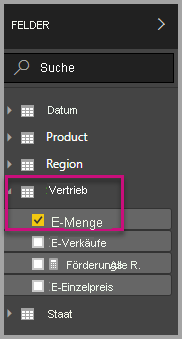

8. <span data-ttu-id="26e78-210">Um dann das neue Visual zu testen, ändern Sie die Größe des Visuals und beachten Sie die Erhöhungen des Aktualisierungswerts.</span><span class="sxs-lookup"><span data-stu-id="26e78-210">Then to test the new visual, resize the visual and notice the update value increments.</span></span>

    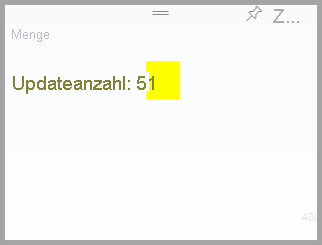

<span data-ttu-id="26e78-212">Um das benutzerdefinierte Visual in PowerShell anzuhalten, geben Sie Strg+C ein.</span><span class="sxs-lookup"><span data-stu-id="26e78-212">To stop the custom visual running in PowerShell, enter Ctrl+C.</span></span> <span data-ttu-id="26e78-213">Wenn Sie dazu aufgefordert werden, den Batchauftrag zu beenden, geben Sie „J“ ein, und drücken Sie die EINGABETASTE.</span><span class="sxs-lookup"><span data-stu-id="26e78-213">When prompted to terminate the batch job, enter Y, then press Enter.</span></span>

## <a name="adding-visual-elements"></a><span data-ttu-id="26e78-214">Hinzufügen von visuellen Elementen</span><span class="sxs-lookup"><span data-stu-id="26e78-214">Adding visual elements</span></span>

<span data-ttu-id="26e78-215">Jetzt müssen Sie die **D3-JavaScript-Bibliothek** installieren.</span><span class="sxs-lookup"><span data-stu-id="26e78-215">Now you need to install the **D3 JavaScript library**.</span></span> <span data-ttu-id="26e78-216">D3 ist eine JavaScript-Bibliothek für die Erstellung dynamischer, interaktiver Datenvisualisierungen in Webbrowsern.</span><span class="sxs-lookup"><span data-stu-id="26e78-216">D3 is a JavaScript library for producing dynamic, interactive data visualizations in web browsers.</span></span> <span data-ttu-id="26e78-217">Dabei werden die weitverbreiteten SVG HTML5- und CSS-Standards verwendet.</span><span class="sxs-lookup"><span data-stu-id="26e78-217">It makes use of widely implemented SVG HTML5, and CSS standards.</span></span>

<span data-ttu-id="26e78-218">Jetzt können Sie das benutzerdefinierte Visual so entwickeln, dass ein Kreis mit Text angezeigt wird.</span><span class="sxs-lookup"><span data-stu-id="26e78-218">Now you can develop the custom visual to display a circle with text.</span></span>

> [!Note]
> <span data-ttu-id="26e78-219">Viele Texteinträge in diesem Tutorial können [hier](https://github.com/Microsoft/powerbi-visuals-circlecard) kopiert werden.</span><span class="sxs-lookup"><span data-stu-id="26e78-219">Many text entries in this tutorial can be copied from [here](https://github.com/Microsoft/powerbi-visuals-circlecard).</span></span>

1. <span data-ttu-id="26e78-220">Geben Sie zum Installieren der **D3-Bibliothek** in PowerShell den folgenden Befehl ein.</span><span class="sxs-lookup"><span data-stu-id="26e78-220">To install the **D3 library** in PowerShell, enter the command below.</span></span>

    ```powershell
    npm i d3@^5.0.0 --save
    ```

    ```powershell
    PS C:\circlecard>npm i d3@^5.0.0 --save
    + d3@5.11.0
    added 179 packages from 169 contributors and audited 306 packages in 33.25s
    found 0 vulnerabilities

    PS C:\circlecard>
    ```

2. <span data-ttu-id="26e78-221">Geben Sie zum Installieren von Typdefinitionen für die **D3-Bibiliothek** den folgenden Befehl ein.</span><span class="sxs-lookup"><span data-stu-id="26e78-221">To install type definitions for the **D3 library**, enter the command below.</span></span>

    ```powershell
    npm i @types/d3@^5.0.0 --save
    ```

    ```powershell
    PS C:\circlecard>npm i @types/d3@^5.0.0 --save
    + @types/d3@5.7.2
    updated 1 package and audited 306 packages in 2.217s
    found 0 vulnerabilities

    PS C:\circlecard>
    ```

    <span data-ttu-id="26e78-222">Mit diesem Befehl werden TypeScript-Definitionen auf der Grundlage von JavaScript-Dateien installiert, sodass Sie das benutzerdefinierte Visual in TypeScript (das eine Obermenge von JavaScript ist) entwickeln können.</span><span class="sxs-lookup"><span data-stu-id="26e78-222">This command installs TypeScript definitions based on JavaScript files, enabling you to develop the custom visual in TypeScript (which is a superset of JavaScript).</span></span> <span data-ttu-id="26e78-223">Visual Studio Code ist die ideale IDE zum Entwickeln von TypeScript-Anwendungen.</span><span class="sxs-lookup"><span data-stu-id="26e78-223">Visual Studio Code is an ideal IDE for developing TypeScript applications.</span></span>

3. <span data-ttu-id="26e78-224">Geben Sie den folgenden Befehl ein, um die \*\*core-js @ no__t-1 in PowerShell zu installieren.</span><span class="sxs-lookup"><span data-stu-id="26e78-224">To install the **core-js** in PowerShell, enter the command below.</span></span>

    ```powershell
    npm i core-js@3.2.1 --save
    ```

    ```powershell
    PS C:\circlecard> npm i core-js@3.2.1 --save

    > core-js@3.2.1 postinstall F:\circlecard\node_modules\core-js
    > node scripts/postinstall || echo "ignore"

    Thank you for using core-js ( https://github.com/zloirock/core-js ) for polyfilling JavaScript standard library!

    The project needs your help! Please consider supporting of core-js on Open Collective or Patreon:
    > https://opencollective.com/core-js
    > https://www.patreon.com/zloirock

    + core-js@3.2.1
    updated 1 package and audited 306 packages in 6.051s
    found 0 vulnerabilities

    PS C:\circlecard>
    ```

    <span data-ttu-id="26e78-225">Mit diesem Befehl wird die modulare Standardbibliothek für JavaScript installiert.</span><span class="sxs-lookup"><span data-stu-id="26e78-225">This command installs modular standard library for JavaScript.</span></span> <span data-ttu-id="26e78-226">Sie enthält polyfills für ECMAScript bis zu 2019.</span><span class="sxs-lookup"><span data-stu-id="26e78-226">It includes polyfills for ECMAScript up to 2019.</span></span> <span data-ttu-id="26e78-227">Weitere Informationen [`core-js`](https://www.npmjs.com/package/core-js)</span><span class="sxs-lookup"><span data-stu-id="26e78-227">Read more about [`core-js`](https://www.npmjs.com/package/core-js)</span></span>

4. <span data-ttu-id="26e78-228">Geben Sie den folgenden Befehl ein, um die \*\*powerbi-Visual-API @ no__t-1 in PowerShell zu installieren.</span><span class="sxs-lookup"><span data-stu-id="26e78-228">To install the **powerbi-visual-api** in PowerShell, enter the command below.</span></span>

    ```powershell
    npm i powerbi-visuals-api --save-dev
    ```

    ```powershell
    PS C:\circlecard>npm i powerbi-visuals-api --save-dev

    + powerbi-visuals-api@2.6.1
    updated 1 package and audited 306 packages in 2.139s
    found 0 vulnerabilities

    PS C:\circlecard>
    ```

    <span data-ttu-id="26e78-229">Mit diesem Befehl werden Power BI visuellen API-Definitionen installiert.</span><span class="sxs-lookup"><span data-stu-id="26e78-229">This command installs Power BI Visuals API definitions.</span></span>

5. <span data-ttu-id="26e78-230">Starten Sie [Visual Studio Code](https://code.visualstudio.com/).</span><span class="sxs-lookup"><span data-stu-id="26e78-230">Launch [Visual Studio Code](https://code.visualstudio.com/).</span></span>

    <span data-ttu-id="26e78-231">Mit dem folgenden Befehl können Sie **Visual Studio Code** über PowerShell starten.</span><span class="sxs-lookup"><span data-stu-id="26e78-231">You can launch **Visual Studio Code** from PowerShell by using the following command.</span></span>

    ```powershell
    code .
    ```

6. <span data-ttu-id="26e78-232">Erweitern Sie im **Explorerbereich** den Ordner **node_modules**, um zu überprüfen, ob die **D3-Bibliothek** installiert wurde.</span><span class="sxs-lookup"><span data-stu-id="26e78-232">In the **Explorer pane**, expand the **node_modules** folder to verify that the **d3 library** was installed.</span></span>

    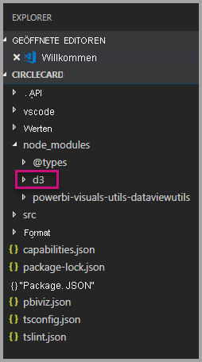

7. <span data-ttu-id="26e78-234">Stellen Sie sicher, dass die Datei \*\*index. d. TS @ no__t-1 hinzugefügt wurde, indem Sie node_modules > @types > D3 im Bereich \*\*eXplorer @ no__t-4 erweitern.</span><span class="sxs-lookup"><span data-stu-id="26e78-234">Make sure that file **index.d.ts** was added, by expanding node_modules > @types > d3 in the **Explorer pane**.</span></span>

    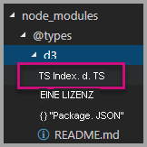

### <a name="developing-the-visual-elements"></a><span data-ttu-id="26e78-236">Entwickeln der visuellen Elemente</span><span class="sxs-lookup"><span data-stu-id="26e78-236">Developing the visual elements</span></span>

<span data-ttu-id="26e78-237">Jetzt können wir uns ansehen, wie wir das benutzerdefinierte Visual entwickeln können, um einen Kreis und Beispieltext anzuzeigen.</span><span class="sxs-lookup"><span data-stu-id="26e78-237">Now we can explore how to develop the custom visual to show a circle and sample text.</span></span>

1. <span data-ttu-id="26e78-238">Erweitern Sie im **Explorerbereich** den Ordner **src**, und wählen Sie **visual.ts** aus.</span><span class="sxs-lookup"><span data-stu-id="26e78-238">In the **Explorer pane**, expand the **src** folder and then select **visual.ts**.</span></span>

    > [!Note]
    > <span data-ttu-id="26e78-239">Beachten Sie die Kommentare am oberen Rand der Datei **visual.ts**.</span><span class="sxs-lookup"><span data-stu-id="26e78-239">Notice the comments at the top of the **visual.ts** file.</span></span> <span data-ttu-id="26e78-240">Die Berechtigung zur Nutzung der Pakete für benutzerdefinierten Visuals in Power BI wird unter den Bedingungen der MIT-Lizenz kostenlos erteilt.</span><span class="sxs-lookup"><span data-stu-id="26e78-240">Permission to use the Power BI custom visual packages is granted free of charge under the terms of the MIT License.</span></span> <span data-ttu-id="26e78-241">Als Teil der Vereinbarung müssen Sie die Kommentare im oberen Bereich der Datei beibehalten.</span><span class="sxs-lookup"><span data-stu-id="26e78-241">As part of the agreement, you must leave the comments at the top of the file.</span></span>

2. <span data-ttu-id="26e78-242">Entfernen Sie die folgende Logik für das benutzerdefinierte Visual aus der Visual-Klasse.</span><span class="sxs-lookup"><span data-stu-id="26e78-242">Remove the following default custom visual logic from the Visual class.</span></span>
    * <span data-ttu-id="26e78-243">Die vier privaten Variablendeklarationen auf Klassenebene.</span><span class="sxs-lookup"><span data-stu-id="26e78-243">The four class-level private variable declarations.</span></span>
    * <span data-ttu-id="26e78-244">Alle Codezeilen aus dem Konstruktor.</span><span class="sxs-lookup"><span data-stu-id="26e78-244">All lines of code from the constructor.</span></span>
    * <span data-ttu-id="26e78-245">Alle Codezeilen aus der Updatemethode.</span><span class="sxs-lookup"><span data-stu-id="26e78-245">All lines of code from the update method.</span></span>
    * <span data-ttu-id="26e78-246">Alle verbleibenden Zeilen innerhalb des Moduls, einschließlich der parseSettings- und enumerateObjectInstances-Methoden.</span><span class="sxs-lookup"><span data-stu-id="26e78-246">All remaining lines within the module, including the parseSettings and enumerateObjectInstances methods.</span></span>

    <span data-ttu-id="26e78-247">Stellen Sie sicher, dass der Modulcode wie folgt aussieht.</span><span class="sxs-lookup"><span data-stu-id="26e78-247">Verify that the module code looks like the following.</span></span>

    ```typescript
    "use strict";
    import "core-js/stable";
    import "../style/visual.less";
    import powerbi from "powerbi-visuals-api";
    import IVisual = powerbi.extensibility.IVisual;
    import VisualConstructorOptions = powerbi.extensibility.visual.VisualConstructorOptions;
    import VisualUpdateOptions = powerbi.extensibility.visual.VisualUpdateOptions;

    import * as d3 from "d3";
    type Selection<T extends d3.BaseType> = d3.Selection<T, any,any, any>;

    export class Visual implements IVisual {

        constructor(options: VisualConstructorOptions) {

        }

        public update(options: VisualUpdateOptions) {

        }
    }
    ```

3. <span data-ttu-id="26e78-248">Fügen Sie unter der *Visual*-Klassendeklaration die folgenden Eigenschaften auf Klassenebene ein.</span><span class="sxs-lookup"><span data-stu-id="26e78-248">Beneath the *Visual* class declaration, insert the following class-level properties.</span></span>

    ```typescript
    export class Visual implements IVisual {
        // ...
        private host: IVisualHost;
        private svg: Selection<SVGElement>;
        private container: Selection<SVGElement>;
        private circle: Selection<SVGElement>;
        private textValue: Selection<SVGElement>;
        private textLabel: Selection<SVGElement>;
        // ...
    }
    ```

    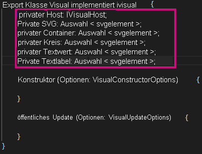

4. <span data-ttu-id="26e78-250">Fügen Sie den folgenden Code zum *Konstruktor* hinzu.</span><span class="sxs-lookup"><span data-stu-id="26e78-250">Add the following code to the *constructor*.</span></span>

    ```typescript
    this.svg = d3.select(options.element)
        .append('svg')
        .classed('circleCard', true);
    this.container = this.svg.append("g")
        .classed('container', true);
    this.circle = this.container.append("circle")
        .classed('circle', true);
    this.textValue = this.container.append("text")
        .classed("textValue", true);
    this.textLabel = this.container.append("text")
        .classed("textLabel", true);
    ```

    <span data-ttu-id="26e78-251">Dieser Code fügt eine SVG-Gruppe innerhalb des Visuals hinzu und fügt dann drei Formen hinzu: einen Kreis und zwei Textelemente.</span><span class="sxs-lookup"><span data-stu-id="26e78-251">This code adds an SVG group inside the visual and then adds three shapes: a circle and two text elements.</span></span>

    <span data-ttu-id="26e78-252">Um den Code im Dokument zu formatieren, wählen Sie mit der rechten Maustaste eine beliebige Stelle im **Visual Studio Code-Dokument**, und wählen Sie dann **Dokument formatieren**.</span><span class="sxs-lookup"><span data-stu-id="26e78-252">To format the code in the document, right-select anywhere in the **Visual Studio Code document**, and then select **Format Document**.</span></span>

      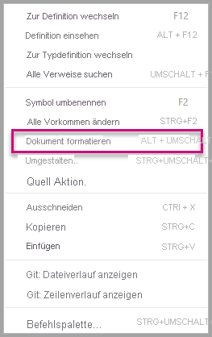

    <span data-ttu-id="26e78-254">Um die Lesbarkeit zu verbessern, wird empfohlen, dass Sie das Dokument jedes Mal formatieren, wenn Sie Codeausschnitte einfügen.</span><span class="sxs-lookup"><span data-stu-id="26e78-254">To improve readability, it is recommended that you format the document every time that paste in code snippets.</span></span>

5. <span data-ttu-id="26e78-255">Fügen Sie den folgenden Code zur *Updatemethode* hinzu.</span><span class="sxs-lookup"><span data-stu-id="26e78-255">Add the following code to the *update* method.</span></span>

    ```typescript
    let width: number = options.viewport.width;
    let height: number = options.viewport.height;
    this.svg.attr("width", width);
    this.svg.attr("height", height);
    let radius: number = Math.min(width, height) / 2.2;
    this.circle
        .style("fill", "white")
        .style("fill-opacity", 0.5)
        .style("stroke", "black")
        .style("stroke-width", 2)
        .attr("r", radius)
        .attr("cx", width / 2)
        .attr("cy", height / 2);
    let fontSizeValue: number = Math.min(width, height) / 5;
    this.textValue
        .text("Value")
        .attr("x", "50%")
        .attr("y", "50%")
        .attr("dy", "0.35em")
        .attr("text-anchor", "middle")
        .style("font-size", fontSizeValue + "px");
    let fontSizeLabel: number = fontSizeValue / 4;
    this.textLabel
        .text("Label")
        .attr("x", "50%")
        .attr("y", height / 2)
        .attr("dy", fontSizeValue / 1.2)
        .attr("text-anchor", "middle")
        .style("font-size", fontSizeLabel + "px");
    ```

    <span data-ttu-id="26e78-256">*Dieser Code legt die Breite und Höhe des Visuals fest und initialisiert dann die Attribute und Stile der visuellen Elemente.*</span><span class="sxs-lookup"><span data-stu-id="26e78-256">*This code sets the width and height of the visual, and then initializes the attributes and styles of the visual elements.*</span></span>

6. <span data-ttu-id="26e78-257">Speichern Sie die Datei **visual.ts**.</span><span class="sxs-lookup"><span data-stu-id="26e78-257">Save the **visual.ts** file.</span></span>

7. <span data-ttu-id="26e78-258">Wählen Sie die Datei **capabilities.json** aus.</span><span class="sxs-lookup"><span data-stu-id="26e78-258">Select the **capabilities.json** file.</span></span>

    <span data-ttu-id="26e78-259">Entfernen Sie in Zeile 14 das gesamte Objektelement (Zeilen 14-60).</span><span class="sxs-lookup"><span data-stu-id="26e78-259">At line 14, remove the entire objects element (lines 14-60).</span></span>

8. <span data-ttu-id="26e78-260">Speichern Sie die Datei **capabilities.json**.</span><span class="sxs-lookup"><span data-stu-id="26e78-260">Save the **capabilities.json** file.</span></span>

9. <span data-ttu-id="26e78-261">Starten Sie das benutzerdefinierte Visual in PowerShell.</span><span class="sxs-lookup"><span data-stu-id="26e78-261">In PowerShell, start the custom visual.</span></span>

    ```powershell
    pbiviz start
    ```

### <a name="toggle-auto-reload"></a><span data-ttu-id="26e78-262">Automatisches erneutes Laden aktivieren/deaktivieren</span><span class="sxs-lookup"><span data-stu-id="26e78-262">Toggle auto reload</span></span>

1. <span data-ttu-id="26e78-263">Navigieren Sie zurück zum Power BI-Bericht.</span><span class="sxs-lookup"><span data-stu-id="26e78-263">Navigate back to the Power BI report.</span></span>
2. <span data-ttu-id="26e78-264">Wählen Sie in der Symbolleiste über dem visuellen Entwicklerelement **Automatisches erneutes Laden aktivieren/deaktivieren** aus.</span><span class="sxs-lookup"><span data-stu-id="26e78-264">In the toolbar floating above the developer visual, select the **Toggle Auto Reload**.</span></span>

    

    <span data-ttu-id="26e78-266">Diese Option stellt sicher, dass das Visual bei jedem Speichern von Projektänderungen automatisch neu geladen wird.</span><span class="sxs-lookup"><span data-stu-id="26e78-266">This option ensures that the visual is automatically reloaded each time you save project changes.</span></span>

3. <span data-ttu-id="26e78-267">Ziehen Sie die Option **Menge** aus dem **Bereich „Felder“** in das visuelle Entwicklerelement.</span><span class="sxs-lookup"><span data-stu-id="26e78-267">From the **Fields pane**, drag the **Quantity** field into the developer visual.</span></span>

4. <span data-ttu-id="26e78-268">Stellen Sie sicher, dass das Visual wie folgt aussieht.</span><span class="sxs-lookup"><span data-stu-id="26e78-268">Verify that the visual looks like the following.</span></span>

    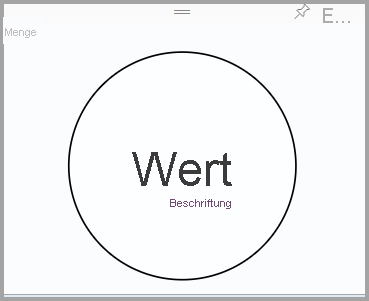

5. <span data-ttu-id="26e78-270">Ändern Sie Größe des Visuals.</span><span class="sxs-lookup"><span data-stu-id="26e78-270">Resize the visual.</span></span>

    <span data-ttu-id="26e78-271">Beachten Sie, dass sich der Kreis- und Textwert an die verfügbare Dimension des Visuals anpasst.</span><span class="sxs-lookup"><span data-stu-id="26e78-271">Notice that the circle and text value scales to fit the available dimension of the visual.</span></span>

    <span data-ttu-id="26e78-272">Die Updatemethode wird kontinuierlich mit der Größenänderung des Visuals aufgerufen, und sie führt zur flüssigen Skalierung der visuellen Elemente.</span><span class="sxs-lookup"><span data-stu-id="26e78-272">The update method is called continuously with resizing the visual, and it results in the fluid rescaling of the visual elements.</span></span>

    <span data-ttu-id="26e78-273">Sie haben nun die visuellen Elemente entwickelt.</span><span class="sxs-lookup"><span data-stu-id="26e78-273">You have now developed the visual elements.</span></span>

6. <span data-ttu-id="26e78-274">Führen Sie das Visual weiter aus.</span><span class="sxs-lookup"><span data-stu-id="26e78-274">Continue running the visual.</span></span>

## <a name="process-data-in-the-visual-code"></a><span data-ttu-id="26e78-275">Verarbeiten von Daten im visuellen Code</span><span class="sxs-lookup"><span data-stu-id="26e78-275">Process data in the visual code</span></span>

<span data-ttu-id="26e78-276">Definieren Sie die Datenrollen und Datenansichtsmappings, und ändern Sie dann die Logik des benutzerdefinierten Visuals, um den Wert und den Anzeigenamen einer Kennzahl anzuzeigen.</span><span class="sxs-lookup"><span data-stu-id="26e78-276">Define the data roles and data view mappings, and then modify the custom visual logic to display the value and display name of a measure.</span></span>

### <a name="configuring-the-capabilities"></a><span data-ttu-id="26e78-277">Konfigurieren von Funktionen</span><span class="sxs-lookup"><span data-stu-id="26e78-277">Configuring the capabilities</span></span>

<span data-ttu-id="26e78-278">Ändern Sie die Datei **capabilities.json**, um die Datenrollen- und Datenansichtsmappings zu definieren.</span><span class="sxs-lookup"><span data-stu-id="26e78-278">Modify the **capabilities.json** file to define the data role and data view mappings.</span></span>

1. <span data-ttu-id="26e78-279">Entfernen Sie in Visual Studio Code in der Datei **capabilities.json** aus dem Array **dataRoles** alle Inhalte (Zeilen 3-12).</span><span class="sxs-lookup"><span data-stu-id="26e78-279">In Visual Studio code, in the **capabilities.json** file, from inside the **dataRoles** array, remove all content (lines 3-12).</span></span>

2. <span data-ttu-id="26e78-280">Fügen Sie im Array **dataRoles** den folgenden Code ein.</span><span class="sxs-lookup"><span data-stu-id="26e78-280">Inside the **dataRoles** array, insert the following code.</span></span>

    ```json
    {
        "displayName": "Measure",
        "name": "measure",
        "kind": "Measure"
    }
    ```

    <span data-ttu-id="26e78-281">Das Array **dataRoles** definiert nun eine einzelne Rolle vom Typ **measure**, d.h. mit dem Namen **measure** und zeigt sie als **measure** an.</span><span class="sxs-lookup"><span data-stu-id="26e78-281">The **dataRoles** array now defines a single data role of type **measure**, that is named **measure**, and displays as **Measure**.</span></span> <span data-ttu-id="26e78-282">Diese Datenrolle ermöglicht die Übergabe entweder eines Kennzahlfeldes oder eines zusammenfassenden Feldes.</span><span class="sxs-lookup"><span data-stu-id="26e78-282">This data role allows passing either a measure field, or a field that is summarized.</span></span>

3. <span data-ttu-id="26e78-283">Entfernen Sie im Array **dataViewMappings** alle Inhalte (Zeilen 10-31).</span><span class="sxs-lookup"><span data-stu-id="26e78-283">From inside the **dataViewMappings** array, remove all content (lines 10-31).</span></span>

4. <span data-ttu-id="26e78-284">Fügen Sie im Array **dataViewMappings** den folgenden Inhalt ein.</span><span class="sxs-lookup"><span data-stu-id="26e78-284">Inside the **dataViewMappings** array, insert the following content.</span></span>

    ```json
    {
        "conditions": [
            { "measure": { "max": 1 } }
        ],
        "single": {
            "role": "measure"
        }
    }
    ```

    <span data-ttu-id="26e78-285">Das Array **dataViewMappings** definiert jetzt ein Feld, das an die Datenrolle mit der Bezeichnung **measure** übergeben werden kann.</span><span class="sxs-lookup"><span data-stu-id="26e78-285">The **dataViewMappings** array now defines one field can be passed to the data role named **measure**.</span></span>

5. <span data-ttu-id="26e78-286">Speichern Sie die Datei **capabilities.json**.</span><span class="sxs-lookup"><span data-stu-id="26e78-286">Save the **capabilities.json** file.</span></span>

6. <span data-ttu-id="26e78-287">Beachten Sie, dass das Visual jetzt in Power BI mit einer **Kennzahl** konfiguriert werden kann.</span><span class="sxs-lookup"><span data-stu-id="26e78-287">In Power BI, notice that the visual now can be configured with **Measure**.</span></span>

    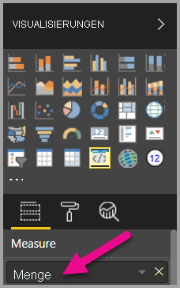

    > [!Note]
    > <span data-ttu-id="26e78-289">Das Visualprojekt enthält noch keine Datenbindungslogik.</span><span class="sxs-lookup"><span data-stu-id="26e78-289">The visual project does not yet include data binding logic.</span></span>

### <a name="exploring-the-dataview"></a><span data-ttu-id="26e78-290">Untersuchen der Datenansicht</span><span class="sxs-lookup"><span data-stu-id="26e78-290">Exploring the dataview</span></span>

1. <span data-ttu-id="26e78-291">Wählen Sie in der Symbolleiste über dem Visual **Datenansicht anzeigen**.</span><span class="sxs-lookup"><span data-stu-id="26e78-291">In the toolbar floating above the visual, select **Show Dataview**.</span></span>

    

2. <span data-ttu-id="26e78-293">Erweitern Sie die Ansicht bis zum Wert **Einzeln**, und notieren Sie den Wert.</span><span class="sxs-lookup"><span data-stu-id="26e78-293">Expand down into **single**, and then notice the value.</span></span>

    

3. <span data-ttu-id="26e78-295">Expandieren Sie nach unten bis **metadata** und dann bis zum Array **columns**, und beachten Sie dabei insbesondere die Werte **format** und **displayName**.</span><span class="sxs-lookup"><span data-stu-id="26e78-295">Expand down into **metadata**, and then into the **columns** array, and in particular notice the **format** and **displayName** values.</span></span>

    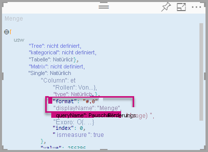

4. <span data-ttu-id="26e78-297">Um zum Visual zurückzukehren, wählen Sie in der Symbolleiste über dem Visual **Datenansicht anzeigen**.</span><span class="sxs-lookup"><span data-stu-id="26e78-297">To toggle back to the visual, in the toolbar floating above the visual, select **Show Dataview**.</span></span>

    

### <a name="consume-data-in-the-visual-code"></a><span data-ttu-id="26e78-299">Verwenden von Daten im visuellen Code</span><span class="sxs-lookup"><span data-stu-id="26e78-299">Consume data in the visual code</span></span>

1. <span data-ttu-id="26e78-300">In **visual Studio Code @ no__t-1 in der Datei "**visual. TS @ no__t-3"</span><span class="sxs-lookup"><span data-stu-id="26e78-300">In **Visual Studio Code**, in the **visual.ts** file,</span></span>

    <span data-ttu-id="26e78-301">Importieren der `DataView`-Schnittstelle aus `powerbi`-Modul</span><span class="sxs-lookup"><span data-stu-id="26e78-301">import the `DataView` interface from `powerbi` module</span></span>

    ```typescript
    import DataView = powerbi.DataView;
    ```

    <span data-ttu-id="26e78-302">Fügen Sie die folgende Anweisung als erste Anweisung der Update-Methode hinzu.</span><span class="sxs-lookup"><span data-stu-id="26e78-302">and add the following statement as the first statement of the update method.</span></span>

    ```typescript
    let dataView: DataView = options.dataViews[0];
    ```

    

    <span data-ttu-id="26e78-304">Diese Anweisung weist *dataView* einer Variablen für einen einfachen Zugriff zu und deklariert die Variable, um auf das Objekt *dataView* zu verweisen.</span><span class="sxs-lookup"><span data-stu-id="26e78-304">This statement assigns the *dataView* to a variable for easy access, and declares the variable to reference the *dataView* object.</span></span>

2. <span data-ttu-id="26e78-305">Ersetzen Sie **.text("Value")** in der **update**-Methode durch das Folgende.</span><span class="sxs-lookup"><span data-stu-id="26e78-305">In the **update** method, replace **.text("Value")** with the following.</span></span>

    ```typescript
    .text(<string>dataView.single.value)
    ```

    

3. <span data-ttu-id="26e78-307">Ersetzen Sie **.text("Label")** in der **update**-Methode durch das Folgende.</span><span class="sxs-lookup"><span data-stu-id="26e78-307">In the **update** method, replace **.text("Label")** with the following.</span></span>

    ```typescript
    .text(dataView.metadata.columns[0].displayName)
    ```

    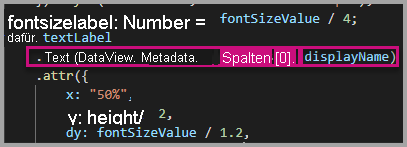

4. <span data-ttu-id="26e78-309">Speichern Sie die Datei **visual.ts**.</span><span class="sxs-lookup"><span data-stu-id="26e78-309">Save the **visual.ts** file.</span></span>

5. <span data-ttu-id="26e78-310">Überprüfen Sie in **Power BI** das Visual, das nun den Wert und den Anzeigenamen anzeigt.</span><span class="sxs-lookup"><span data-stu-id="26e78-310">In **Power BI**, review the visual, which now displays the value and the display name.</span></span>

<span data-ttu-id="26e78-311">Sie haben nun die Datenrollen konfiguriert und das Visual an die Datenansicht gebunden.</span><span class="sxs-lookup"><span data-stu-id="26e78-311">You have now configured the data roles and bound the visual to the dataview.</span></span>

<span data-ttu-id="26e78-312">Im nächsten Tutorial erfahren Sie, wie Sie dem benutzerdefinierten Visual Formatierungsoptionen hinzufügen können.</span><span class="sxs-lookup"><span data-stu-id="26e78-312">In the next tutorial you learn how to add formatting options to the custom visual.</span></span>

## <a name="debugging"></a><span data-ttu-id="26e78-313">Debuggen</span><span class="sxs-lookup"><span data-stu-id="26e78-313">Debugging</span></span>

<span data-ttu-id="26e78-314">Tipps zum Debuggen von benutzerdefinierten Visualisierungen finden Sie im [Debug-Handbuch](https://microsoft.github.io/PowerBI-visuals/docs/how-to-guide/how-to-debug/).</span><span class="sxs-lookup"><span data-stu-id="26e78-314">For tips about debugging your custom visual, see the [debugging guide](https://microsoft.github.io/PowerBI-visuals/docs/how-to-guide/how-to-debug/).</span></span>

## <a name="next-steps"></a><span data-ttu-id="26e78-315">Nächste Schritte</span><span class="sxs-lookup"><span data-stu-id="26e78-315">Next steps</span></span>

> [!div class="nextstepaction"]
> [<span data-ttu-id="26e78-316">Hinzufügen von Formatierungsoptionen</span><span class="sxs-lookup"><span data-stu-id="26e78-316">Adding formatting options</span></span>](custom-visual-develop-tutorial-format-options.md)
